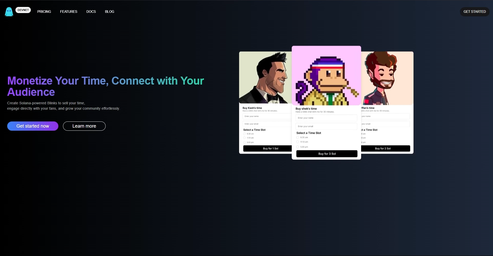

# 🔗 Blink-Meet — Monetize Your Time on Twitter with Solana

**Blink-Meet** is a web application that empowers Twitter influencers to create paid, Solana-powered Zoom meeting links to directly engage with their audience and monetize their time.

Fans can book time slots by paying with SOL, while influencers manage sessions seamlessly through an intuitive dashboard.

---

## ✨ Features

- 🌐 **Shareable Blinks**: Create time-based meeting links designed to unfurl beautifully on Twitter.
- 🔐 **Secure Login**: Easily sign in with Google using NextAuth.js.
- 📆 **Custom Sessions**: Pick 3 time slots and set your rate in SOL.
- 💰 **Solana-Powered Payments**: Receive Devnet SOL payments for booking confirmations.
- 🧾 **Dashboard**: View all your active or past Blink sessions.

---

## 🖼️ Demo

Watch the full walkthrough video here: []("https://youtu.be/AvDOn6HwFfQ")
Here’s how it works in a nutshell:

1. Visit the landing page and log in via Google.
2. View or create Blink sessions via your dashboard.
3. Fill out session details: name, email, wallet, image, time slots, and price.
4. Generate a shareable Blink URL.
5. Fans click the link, view the times, and book a slot by paying SOL.
6. Booking is confirmed on-chain via Devnet.

---

## 🚀 Getting Started

### Prerequisites

- Node.js ≥ 18
- npm
- Docker
- Mongo Compass
- Solana CLI (for generating wallets)
- Phantom wallet (for browser testing)
- Google OAuth credentials (for NextAuth)

### Installation

```bash
git clone https://github.com/yourusername/blinks.git
cd blinks
npm install
```

add all the environment variables fron .env.sample
then:

```bash
npx prisma db push
npm run start
```
